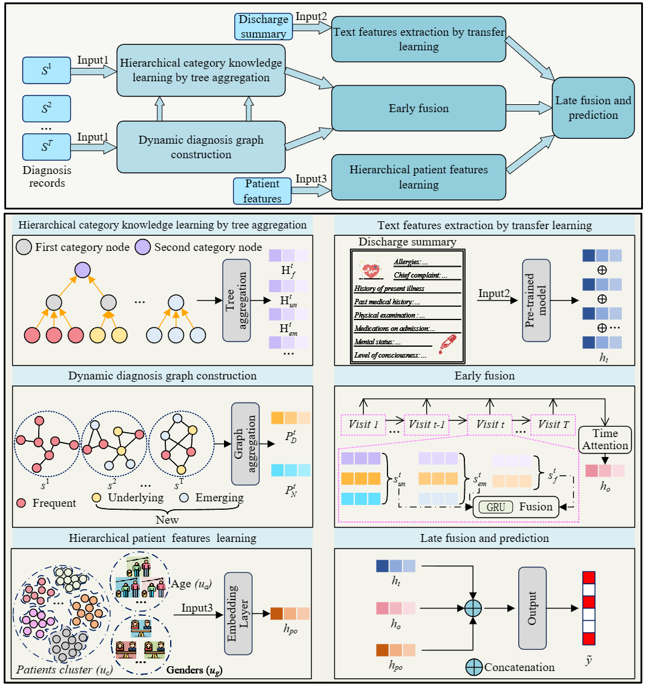

# HKLHEP 
This repository is a code impletement of the paper HKLHEP.

## 1.MIMIC-III task steps

The first step, please

```
 python3 ./data/mimic3/encoded/k-means.py.
```

The second step, 

```
python3 run_preprocess.py.
```

The third step is to modify the parameters in 

```
`models/models2.py`
```

 based on the settings provided in the paper.

The fourth step is to run 

```
`python3 train.py`.
```

# HKLHEP
This repository is a code impletement of the paper HKLHEP. We are only releasing part of the code for now. Once the paper is accepted, we will release the full code.
